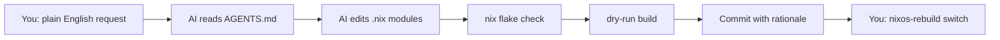

# NixOS Configuration

**Your dotfiles, but declarative. Your sysadmin, but an AI.**

This isn't just another NixOS config — it's an **AI-native operating system definition**. Drop an AI agent into this repository with [`AGENTS.md`](AGENTS.md), describe what you want in plain English, and it understands the architecture, edits the right modules, runs `nix flake check`, and hands you a verified commit. No memorizing Nix syntax. No hunting for the right option path.

| | |
|---|---|
| **Package manager** | Nix Flakes + Snowfall Lib |
| **Desktop** | GNOME + GDM |
| **Boot security** | TPM2 LUKS auto-unlock (zero-password boot) |
| **Authentication** | Fingerprint + password with GNOME Keyring unlock |
| **Secrets** | `sops-nix` with age encryption |
| **Editor** | NixVim (modular plugin tree) + Doom Emacs |
| **Documentation** | NDH framework — JSDoc headers, rationale-first comments |

## The AI-Managed Workflow

The `AGENTS.md` file at the root is the constitution. It encodes the entire architecture, naming conventions, module patterns, pin policies, and behavioral rules. Any compliant AI agent (Crush, Claude, Cursor) reads it on entry and operates with full context.



### What the AI handles

- **Module creation** — place a new `.nix` file in the right directory, Snowfall auto-discovers it
- **Option wiring** — knows the `my.*` namespace, `mkEnableOption` pattern, and `mkIf` gating
- **Pin management** — respects existing overlay pins, never unpins without understanding why
- **Documentation** — enforces NDH headers and rationale comments on every file
- **Validation** — runs `nix flake check` and dry-run builds before committing
- **Secret safety** — detects `sops-nix` boundaries, never exposes decrypted secrets

### What you still do

- `nixos-rebuild switch` — system activation is always manual
- `nix flake update` — lockfile updates are never automated
- `git push` / `git push-public` — remote sync is always explicit

## Architecture at a Glance

```
flake.nix                 — mkFlake entry point, no manual outputs
systems/                  — per-host NixOS configs (auto-discovered)
homes/                    — per-user Home Manager configs (username@hostname)
modules/nixos/            — system modules under my.* namespace
modules/home/             — user modules under my.* namespace
packages/                 — custom Nix packages
overlays/                 — pinned package overlays (stable, emacs, etc.)
secrets/                  — sops-nix encrypted YAML
```

Every module follows a strict boolean-gate pattern: `options.my.<name>.enable` → `config = mkIf cfg.enable { ... }`. No magic. No hidden state. Toggle anything on or off.

## Getting Started

### Prerequisites

Nix with flakes enabled:
```nix
nix.settings.experimental-features = [ "nix-command" "flakes" ];
```

### Quick start

```bash
# Clone (replace with your fork)
git clone <repo-url> nixos-config && cd nixos-config

# Create your personal config
cp modules/nixos/users/personal.nix.example modules/nixos/users/personal.nix
# Edit personal.nix — set your username, email, timezone

# Generate hardware config
nixos-generate-config --show-hardware-config > systems/x86_64-linux/nixos/hardware-configuration.nix

# Dry-run to verify everything compiles
nix build path:.#nixosConfigurations.nixos.config.system.build.toplevel --dry-run

# Apply
sudo nixos-rebuild switch --flake path:.#nixos
```

> **Note:** Always use `path:.` (not bare `.`) so gitignored files like `personal.nix` are included in the Nix store.

For detailed step-by-step instructions including hostname renaming, secrets setup, and Home Manager customization, see **[REPLICATION.md](REPLICATION.md)**.

## Security Model

### Boot (zero-password)
The TPM2 chip seals your LUKS key to PCR registers 0+7 (firmware + Secure Boot state). At boot, the TPM releases the key only if the system hasn't been tampered with. Result: you reach GDM without typing a password.

### Login (fingerprint or password)
| Method | Session | Keyring | When to use |
|--------|---------|---------|-------------|
| Fingerprint | Unlocked | Locked | Quick sessions, browsing |
| Password | Unlocked | Unlocked | Full session with saved credentials |

The GNOME Keyring is encrypted with your login password. Fingerprints are mathematical hashes — they can't derive the decryption key. Log in with your password once per session to unlock everything.

### Secrets
All sensitive values live in `secrets/secrets.yaml`, encrypted with age. At build time, `sops-nix` decrypts them to `/run/secrets/` with proper file ownership. Set `my.security.enable = false` in `personal.nix` to disable secrets entirely.

## Dual-Remote Git Setup

This repo maintains **two remotes** with separate histories:

| Remote | Purpose | Push command |
|--------|---------|-------------|
| `origin` (private) | Full history, daily commits | `git push` |
| `public` | Clean, cherry-picked history | `git push-public` |

The `git push-public` alias cherry-picks new commits onto a clean branch, keeping private ancestor history off the public remote. Private files (`personal.nix`, `hardware-configuration.nix`) are gitignored and never reach either remote.

## NixVim

Neovim is configured as a tree of independent, toggleable modules under `modules/home/editors/nixvim/`:

```
plugins/
├── lsp.nix, treesitter.nix, conform.nix   — core editing
├── blink.nix, luasnip.nix                 — completion + snippets
├── fzf-lua.nix, bufferline.nix            — navigation
├── avante.nix, supermaven.nix             — AI assistance
├── dap.nix, neotest.nix                   — debugging + testing
├── orgmode.nix, mini.nix, snacks.nix      — utilities
└── utils.nix                              — oil, which-key, comment, etc.
```

Each plugin gates on both `my.editors.nixvim.enable` and its own enable toggle. Disable what you don't use. Add new plugins by dropping a file into `plugins/` and importing it.

## Documentation Standards

Every `.nix` file follows the **Nix-Doc Hierarchy (NDH)** framework:

```nix
/**
 * @file: relative/path/to/file.nix
 * @purpose: One-line purpose statement.
 * @type: NixOS Module
 * @namespace: my
 */
```

Inline comments explain the **technical why** behind non-obvious settings. Placeholder comments (`# TODO(config):`) flag thin modules for future extensibility.

## Roadmap

- [x] TPM2 auto-unlock (zero-password boot)
- [x] Fingerprint login with GOODIX driver
- [x] Modular NixVim plugin architecture
- [x] sops-nix secret management
- [x] Dual-remote Git workflow (public/private)
- [x] AI agent operational mandate (`AGENTS.md`)
- [ ] Immutable root ("Erase-Your-Darlings")
- [ ] System-wide theming via Stylix
- [ ] Cross-architecture support (`aarch64-linux`)

## Troubleshooting

Common issues and their solutions are documented in **[docs/TROUBLESHOOTING.md](docs/TROUBLESHOOTING.md)**:

- User vanishes from GDM after rebuild
- Fingerprint doesn't unlock GNOME Keyring
- TPM2 prompts for password after BIOS update
- Home Manager activation fails for template user

---

*Built with [Snowfall Lib](https://github.com/snowfallorg/lib), managed by AI, deployed with Nix.*
